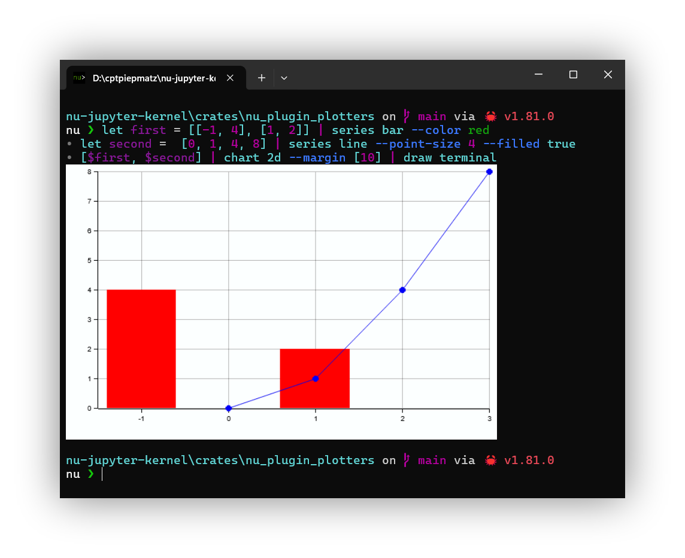

<h1 align="center">nu_plugin_plotters</h1>

  <b>
    A <a href="https://www.nushell.sh">nushell</a> 
    <a href="https://www.nushell.sh/book/plugins.html">plugin</a> for plotting charts.
  </b>

 

  
  
  

## About
`nu_plugin_plotters` is a plugin for [Nushell](https://www.nushell.sh) that 
provides easy plotting of data using 
[`plotters`](https://github.com/plotters-rs/plotters).

## Usage
The plugin provides three main commands:

- **`series`**: 
  Use this command to create a dataset from a list of data points. 
  You can pass in:
  - A table with `x` and `y` columns.
  - A list of 2-element lists representing `x` and `y` coordinates.
  - A plain list of numbers, where the index of each value becomes the `x` value.
  
  You can also apply custom styling to the series.

- **`chart`**: 
  This command creates a chart from one or more series.
  You can either pipe the series into the command or pass them as arguments.
  Charts can also be extended by adding more series, and you have options to
  customize the chart's appearance.

- **`draw`**: 
  This renders the chart onto a canvas.
  You can output to an SVG file (using the `save` command) or display directly
  in the terminal (using iterm, kitty or sixel).

These commands are modular, allowing you to build and inspect charts step by 
step. 
Each command's output is a custom value that can be converted into standard Nu 
values for further inspection or manipulation.

## `nu-jupyter-kernel` Integration
This plugin is directly integrated into the 
[`nu-jupyter-kernel`](https://github.com/cptpiepmatz/nu-jupyter-kernel) and 
therefore doesn't need to installed separately in order to create charts for the 
notebook.

Also charts are automatically "drawn" and don't need to be called via `draw svg`.
Just output the chart and the kernel will execute the `draw svg` command 
automatically (you may need to enforce this using `nuju display svg`).

This plugin is integrated directly into the 
[`nu-jupyter-kernel`](https://github.com/cptpiepmatz/nu-jupyter-kernel), so 
there's no need for separate installation to create charts within Jupyter 
notebooks.

Charts are automatically rendered without the need to explicitly call `draw svg`. 
Simply output the chart, and the kernel will handle the `draw svg` command 
behind the scenes. 
If necessary, you can enforce this behavior by using the 
`nuju display svg` command.

## Version Scheme
This crate follows the semantic versioning scheme as required by the
[Rust documentation](https://doc.rust-lang.org/cargo/reference/semver.html).
The version number is represented as `x.y.z+a.b.c`, where `x.y.z` is the version
of the crate and `a.b.c` is the version of the `nu-plugin` that this crate is 
built with.
The `+` symbol is used to separate the two version numbers.
